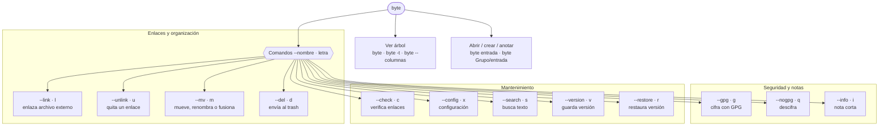

# byte — referencia de comandos

`byte` es un gestor de notas en Markdown y archivos binarios. Organiza el
contenido en **grupos** (carpetas) y **entradas** (archivos), con soporte
para cifrado GPG, enlaces a archivos externos (locales o remotos vía SSH),
versionado histórico y búsqueda de texto.

## Requisitos opcionales

- `gpg` — para `--gpg` / `--nogpg`
- `rg` (ripgrep) — para `--search`, si no está usa `grep`
- `delta` o `bat` — para mostrar diffs con color; si ninguno está instalado, usa `diff` plano

## Vista general



## Referencia rápida

| Comando | Alias | Sintaxis | Qué hace |
|---|---|---|---|
| árbol | | `byte` | Muestra grupos y entradas |
| árbol con fechas | | `byte -t` / `byte --total` | Árbol + fecha de modificación |
| árbol en columnas | | `byte --columnas [-t]` | Árbol en formato de columnas |
| abrir / crear | | `byte entrada` · `byte Grupo/entrada` | Abre en `$EDITOR`, o crea si no existe |
| añadir línea | | `byte entrada texto...` | Añade línea con timestamp, sin abrir editor |
| enlazar | `l` | `byte --link archivo [Grupo/entrada]` | Enlaza un archivo externo (local o remoto) |
| desenlazar | `u` | `byte --unlink [entrada]` | Quita uno o todos los orígenes |
| borrar | `d` | `byte --del [Grupo/ \| entrada]` | Envía al `.trash/` (con manejo de versiones) |
| mover/fusionar | `m` | `byte --mv [origen] [destino]` | Mueve, renombra o fusiona entradas |
| nota | `i` | `byte --info [entrada] [texto]` | Guarda o muestra una nota corta |
| cifrar | `g` | `byte --gpg entrada [llaves...]` | Cifra con GPG o añade destinatarios |
| descifrar | `q` | `byte --nogpg entrada` | Descifra una entrada protegida |
| verificar | `c` | `byte --check` | Revisa config y sincronización de enlaces |
| configurar | `x` | `byte --config` | Configuración interactiva |
| buscar | `s` | `byte --search patrón [grupo]` | Busca texto con `rg`/`grep` |
| versionar | `v` | `byte --version entrada` | Guarda copia con timestamp |
| restaurar | `r` | `byte --restore entrada [n\|timestamp]` | Restaura una versión anterior |
| ayuda | `h` | `byte -h` / `byte --help` | Muestra la ayuda |

> Los nombres de entrada deben tener 4+ caracteres y no pueden coincidir
> con ningún alias reservado (`l u d m i g q c x s v r`).

## Ejemplos de uso

### Ver el árbol

```
$ byte
Trabajo (3)
  reporte.py
  ventas.awk
  pedidos.awk
```

### Abrir, crear o anotar una entrada

```
# Abre en $EDITOR (o la crea si no existe)
$ byte reporte

# Ruta directa Grupo/entrada — no pregunta nada, crea el grupo si falta
$ byte trabajo/torguard

# Añade una línea con timestamp, sin abrir editor
$ byte reporte "arreglado bug de fecha en frontmatter YAML"
```

### Enlazar un archivo externo (`--link` · `l`)

```
$ byte --link ~/scripts/torguard.sh
  La entrada trabajo/torguard no existe, se creará desde el archivo externo.
  Crear trabajo/torguard desde ~/scripts/torguard.sh? (s/N): s
+ trabajo/torguard  → ~/scripts/torguard.sh  (copia)
```

Si ambos ya existen y difieren, aparece un menú de resolución de conflicto:

```
  Conflicto: ambos archivos existen.
    Vault: ~/Notes/Trabajo/torguard.sh
    Externo: /home/jon/scripts/torguard.sh
  [e]ntrada→origen, [o]rigen→entrada, [a]ñadir, [d]iff, [n]ada:
```

- `e` — sobreescribe el archivo externo con el contenido del vault
- `o` — sobreescribe la entrada con el contenido externo
- `a` — solo registra el enlace, sin tocar ningún archivo
- `d` — muestra el diff (con delta/bat si están instalados)
- `n` — cancela

`byte --link` sin argumentos lista todos los enlaces registrados.

### Ver o quitar enlaces (`--unlink` · `u`)

```
$ byte --unlink trabajo/torguard
  ¿Desenlazar trabajo/torguard de ~/scripts/torguard.sh? (s/N): s
- trabajo/torguard  desenlazado
```

### Cifrar y descifrar (`--gpg` · `g` / `--nogpg` · `q`)

```
$ byte --gpg finanzas
~ trabajo/finanzas  g jon@example.com

# Si ya está cifrada, permite añadir destinatarios sin re-crear el archivo
$ byte --gpg finanzas otra@example.com
  g destinatarios actuales:
    jon@example.com  primaria
~ trabajo/finanzas  g → jon@example.com otra@example.com

$ byte --nogpg finanzas
  ¿Descifrar trabajo/finanzas? (s/N): s
~ trabajo/finanzas (descifrado)
```

### Mover, renombrar o fusionar (`--mv` · `m`)

```
# Renombrar dentro del mismo grupo
$ byte --mv trabajo/torguard trabajo/torguardvpn

# Mover a otro grupo (mismo nombre)
$ byte --mv trabajo/torguard server/

# Si el destino ya existe, se fusiona (concatena con separador ---)
$ byte --mv trabajo/notas trabajo/reporte
```

### Notas cortas (`--info` · `i`)

```
$ byte --info trabajo/torguard "pendiente: revisar bridges Moat"
Nota guardada para trabajo/torguard

$ byte --info trabajo/torguard
pendiente: revisar bridges Moat
  → ~/scripts/torguard.sh
```

### Buscar contenido (`--search` · `s`)

```
$ byte --search "tortun0" trabajo
trabajo/torguard
  42:iface tortun0 create
```

### Versionar y restaurar (`--version` · `v` / `--restore` · `r`)

```
$ byte --version reporte
✓ Versión guardada: trabajo/reporte → 2026-07-12 14:03:10

$ byte --restore reporte
Versiones de trabajo/reporte:
  [1] 2026-07-12 14:03:10
  [2] 2026-07-10 09:15:44

  Número, 'd' diff, 'c' cancelar: 1
  ¿Restaurar? (s/N): s
✓ Restaurada 2026-07-12 14:03:10 en trabajo/reporte
```

### Verificar sincronización (`--check` · `c`)

```
$ byte --check

=== CONFIGURACIÓN ===
Directorio: ~/Notes
Editor: micro
Clave GPG primaria: jon@example.com

trabajo/torguard  c → ~/scripts/torguard.sh  (modificado)
  entrada: 2026-07-12 10:00  |  origen: 2026-07-12 14:20
  [o] origen→entrada, [e] entrada→origen, [d]iff, [N]o: d
```

`--check` compara todos los enlaces en paralelo (una sola conexión SSH por
origen remoto) y al final recalcula la caché de abreviaturas.

### Configuración interactiva (`--config` · `x`)

```
$ byte --config

Directorio base [~/Notes]:
Editor [micro]:
Llave GPG primaria [jon@example.com]:
Nueva llave (vacío termina, '-' borra todas):
¿Columnas por defecto? (s/N): s
¿Buscar en cifrados? (s/N): n
Herramienta para diff (auto/delta/bat/diff) [auto]: delta
✓ Guardado en ~/.config/byte/byte.toml
```

## Indicadores (badges)

| Badge | Significado |
|---|---|
| `g` | Entrada cifrada con GPG |
| `b` | Archivo binario (no editable como texto) |
| `i` | Tiene una nota guardada (`--info`) |
| `c →` | Enlazada a una copia local |
| `r →` | Enlazada a un origen remoto (SSH) |
| `x` | El origen enlazado ya no existe |
